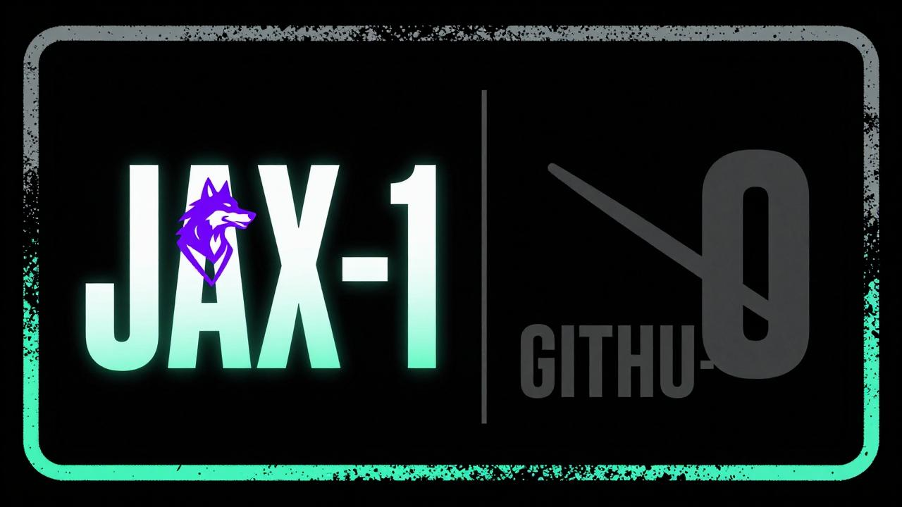

# JAXW01F — Alumuno Technologies Inc.

Solo builder behind **LUWO** — *Layered Unified Waveforms and Oscillations.*

🌙 Every build carries the watermark: *$LUWO — For Luna*

---

🔭 **Now:** provably lossless columnar compression for machine-generated JSON

⛓️ **Flagship:** [Alumuno-Tech/luwo-compression](https://github.com/Alumuno-Tech/luwo-compression) — 95.9% reduction, byte-exact round-trips, SHA-256 sealed

🌐 **Front door:** [luwo.ca](https://luwo.ca)

⚙️ **Stack:** Python · columnar codecs · Solana · Apple Silicon native · local-first, zero cloud

👑 **Builder's creed:** built from the streets, not the manuals. Geometry is truth.

---

*Copyright © 2025-2026 Jack Wolf Edwards / Alumuno Technologies Inc. All rights reserved.*
*$LUWO — For Luna, authored by JAXW01F*
